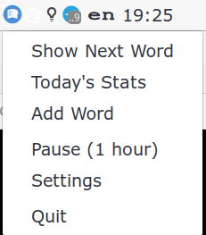
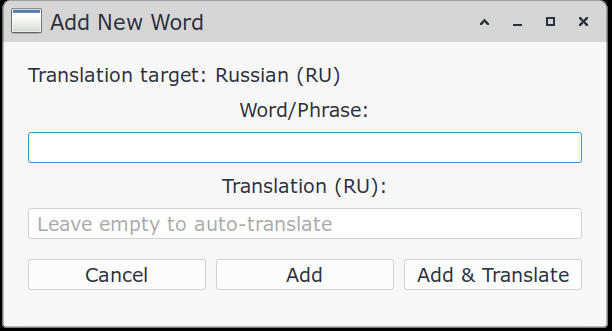
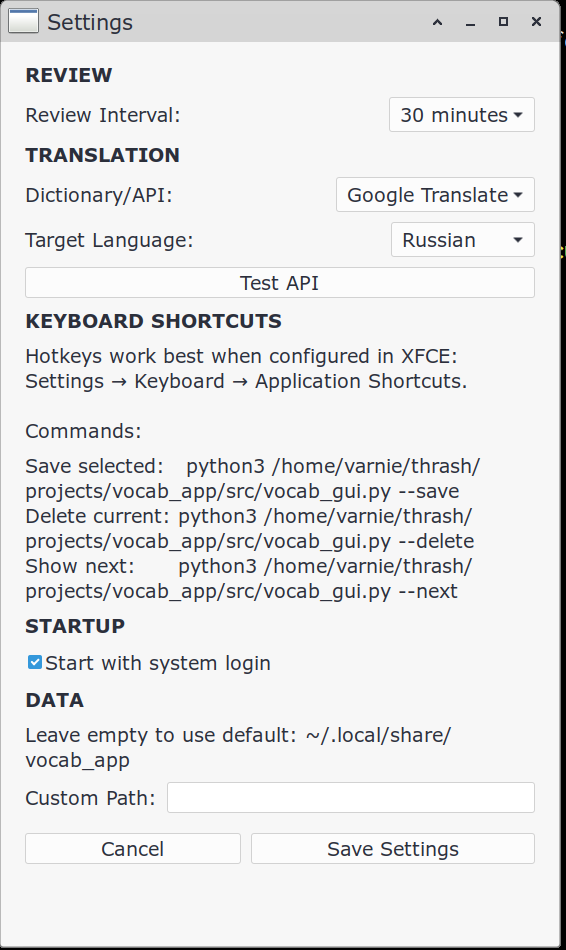
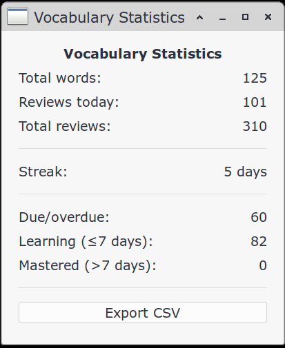
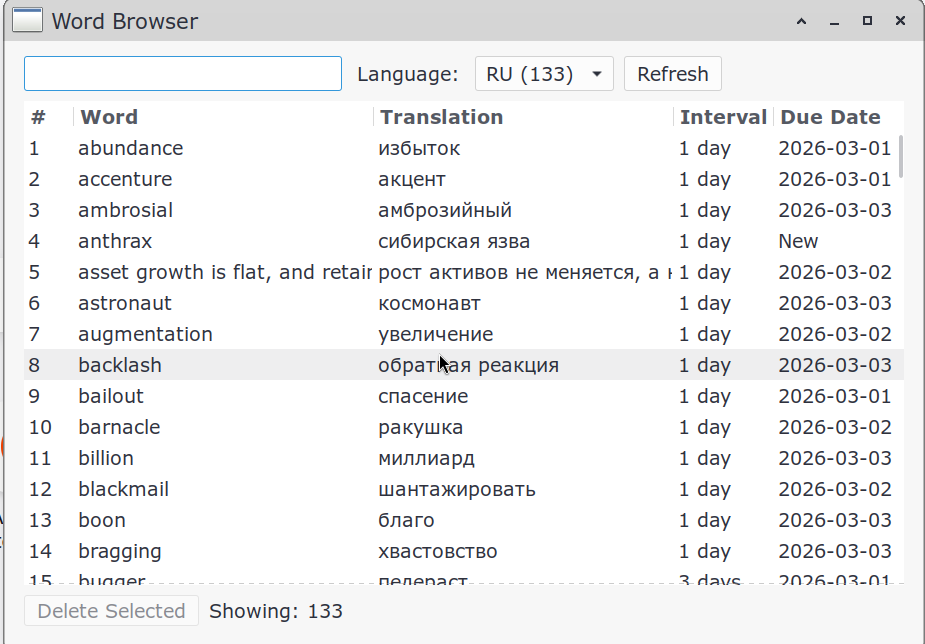
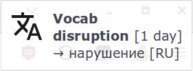

# Vocabulary App

A lightweight vocabulary learning app with system tray and spaced repetition. Supports Linux desktop (XFCE, GNOME, etc.) and macOS with GTK. You control what you learn. Period.

## Features

- **System tray**: Runs in background with tray icon
- **Save phrases**: Select text anywhere, press a hotkey, done
- **Spaced repetition**: SM-2 algorithm for optimal review scheduling
- **Auto-translation**: Automatic translation via multiple providers
- **Multiple translation providers**: Google (direct), Google (deep-translator), EasyGoogle, MyMemory
- **Stats dashboard**: See words learned, streak, reviews today
- **Word Browser**: View, search, edit and delete all words
- **Word of the Day**: Daily vocabulary boost with CEFR-level words (A1-C2)
- **Autostart**: Automatically starts on login
- **Multiple languages**: Support for 9 target languages
- **Custom data directory**: Store database anywhere (e.g., Dropbox for sync)
- **Cross-platform**: Works on Linux and macOS

## Screenshots

### Popup Notification


### Add Word Dialog


### Settings Window


### Statistics Window


### Word Browser


### Popup Translation Message


## GUI App (Recommended)

Located in `src/` folder - modern GTK3 interface with system tray.

### Setup

```bash
./setup.sh
```

This will create a virtual environment and install dependencies:
- `requests` - HTTP library
- `sqlalchemy` - Database ORM
- `deep-translator` - Translation library
- `easygoogletranslate` - Alternative translation

#### Platform-specific dependencies

**Linux (apt):** `python3-gi`, `python3-gi-cairo`, `gir1.2-gtk-3.0`, `gir1.2-appindicator3-0.1`

**Linux (pacman):** `python-gobject`, `gtk3`, `libappindicator-gtk3`

**macOS (Homebrew):** `gtk+3`, `pygobject3`, `adwaita-icon-theme`

### Running

```bash
source venv/bin/activate
python3 src/vocab_gui.py
```

### Keyboard Shortcuts

#### Linux

Configure in your desktop environment settings (usually Settings → Keyboard → Shortcuts):

| Command | Purpose |
|---------|---------|
| `python3 /path/to/src/vocab_cli.py --save` | Save selected text |
| `python3 /path/to/src/vocab_cli.py --delete` | Delete current word |
| `python3 /path/to/src/vocab_cli.py --next` | Show next word |

#### macOS

Configure via System Settings → Keyboard → Shortcuts → Services, or use tools like Hammerspoon or Karabiner-Elements. The same CLI commands apply:

| Command | Purpose |
|---------|---------|
| `python3 /path/to/src/vocab_cli.py --save` | Save clipboard text |
| `python3 /path/to/src/vocab_cli.py --delete` | Delete current word |
| `python3 /path/to/src/vocab_cli.py --next` | Show next word |

### Settings

- **Review interval**: How often to show words (30min - 8hours)
- **Translation provider**: Choose between Google Translate (direct), Google Translate (deep-translator), EasyGoogle Translate, or MyMemory (free)
- **Target language**: Translation language (Russian, Spanish, French, German, Italian, Portuguese, Japanese, Chinese, Korean)
- **Word of the Day**: Enable/disable daily word notifications with CEFR level selection (A1-C2)
- **Autostart**: Automatically starts on system login
- **Custom data directory**: Store database elsewhere

### Database Location

- **Linux default**: `~/.local/share/vocab_app/vocab.db`
- **macOS default**: `~/Library/Application Support/vocab_app/vocab.db`
- Can be changed in settings

## Spaced Repetition

Uses the **SM-2 algorithm**:

- **First review**: 1 day interval
- **Subsequent reviews**: `interval × ease_factor` (default 2.5x)
- **Ease factor**: Increases slightly with each review (minimum 1.3)
- **Maximum interval**: 180 days (≈6 months)

## Troubleshooting

### Linux

#### No popup appears
- Make sure `notify-send` is installed: `sudo apt install libnotify-bin`
- Check that desktop notifications are enabled in your system settings

#### Icons not showing
- If tray icon or popup icon doesn't appear, check file permissions on `icons/` folder

### macOS

#### GTK not found
- Make sure GTK is installed via Homebrew: `brew install gtk+3 pygobject3`
- Ensure the venv was created with `--system-site-packages`

#### No notifications
- Check that notifications are allowed for "Script Editor" in System Settings → Notifications

#### Tray icon not appearing
- GTK StatusIcon may not appear in the macOS menu bar by default. If the tray icon is missing, you can still run the app and interact via notifications and CLI commands.

### General

#### Words don't appear in review
- The app shows words that are due for review (based on interval)
- Make sure your target language matches the translations you want to review
